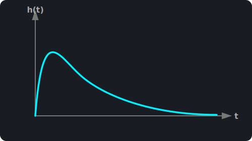

## {background-color="#43e911"}

::: {.container-aviso}
::: {.aviso-fullscreen}
**Dica para Celular:** Para melhor visualização, coloque o celular no modo horizontal.
Clique no **Menu (☰)** → **Tools** → **Fullscreen**.
:::
:::

---

## [Exercício 1: Transformada de Fourier Continua]{style="color: #f1da08; text-align: center; display: block;font-size: 1em;"} {background-color="#000000"}

::: {#lousa-senai}

::: {.fragment .escrita-estavel style="color: #00eeff; font-family: 'Courier New', monospace; font-size: 1.5em;"}
Considere a equação diferencial $\dfrac{d^{2}y(t)}{dt^{2}} + 6\dfrac{dy(t)}{dt} + 8y(t) = x(t)$. Determine:

 * A Função de transferência.
 * A resposta ao impulso.
 * Analise a estabilidade e Causalidade.

:::

::: {.fragment style="color: #43e911; font-family: 'Courier New', monospace; font-size: 1.5em;"}
Cálculo da função de transferência:
:::

::: {.fragment style="font-size: 1.5em;"}
$$\displaystyle (j\omega)^{2}Y(j\omega) + 6(j\omega)Y(j\omega) + 8Y(j\omega) = X(j\omega)$$
:::

::: {.fragment style="font-size: 1.5em;"}
$$\displaystyle Y(j\omega)[ (j\omega)^{2} + 6(j\omega) + 8] = X(j\omega)$$
:::

::: {.fragment style="font-size: 1.5em;"}
$$\displaystyle H(j\omega) =  \dfrac{Y(j\omega)}{X(j\omega)} = \dfrac{1}{(j\omega)^{2} + 6(j\omega) + 8}$$
:::

::: {.fragment style="border: 2px solid #f1da08; border-radius: 15px; margin: 20px auto; padding: 20px; width: 90%; box-sizing: border-box;"}
[**Cálculo Auxiliar: fatoração do polinômio do denominador por completação de quadrado**]{style="color: #08e9f1; font-family: 'Courier New', monospace;font-size: 1.3em; display: block; margin-bottom: 10px;"}

::: {.fragment style="font-size: 1.5em;"}
$$\displaystyle  (j\omega)^{2} + 6(j\omega) + 8$$
:::

::: {.fragment style="font-size: 1.5em;"}
$$\displaystyle (j\omega + 3)^2 - 9  + 8 = 0$$
:::

::: {.fragment style="font-size: 1.5em;"}
$$\displaystyle (j\omega + 3)^2 = 1$$
:::

::: {.fragment style="font-size: 1.5em;"}
$$\displaystyle \sqrt{(j\omega + 3)^2} = \sqrt{1}$$
:::

::: {.fragment style="font-size: 1.5em;"}
$$\displaystyle j\omega + 3 = \pm 1$$
:::

::: {.fragment style="font-size: 1.5em;"}
$$\displaystyle (j\omega + 2)\cdot (j\omega + 4)$$
:::
:::

::: {.fragment .escrita-estavel style="color: #00eeff; font-family: 'Courier New', monospace; font-size: 1.5em;"}
Logo teremos por frações parciais após a completação de quadrado:
:::

::: {.fragment style="font-size: 1.5em;"}
$$\displaystyle H(j\omega) = \dfrac{1}{(j\omega + 2)(j\omega + 4)}$$
:::

::: {.fragment style="font-size: 1.5em;"}
$$\displaystyle \dfrac{1}{(j\omega + 2)(j\omega + 4)} = \dfrac{A}{(j\omega + 2)} + \dfrac{B}{(j\omega + 4)}$$
:::

::: {.fragment style="border: 2px solid #f1da08; border-radius: 15px; margin: 20px auto; padding: 20px; width: 90%; box-sizing: border-box;"}
[**Para determinar os valores das constantes independentes A e B, faremos o seguinte:**]{style="color: #08e9f1; font-family: 'Courier New', monospace;font-size: 1.3em; display: block; margin-bottom: 10px;"}
:::

::: {.fragment style="border: 2px solid #f1da08; border-radius: 15px; margin: 20px auto; padding: 20px; width: 90%; box-sizing: border-box;"}
[**Para determinar a constante A, iguala-se a zero a expressão do denominador a ela associada, isolando-se o valor de $j\omega$. Em seguida, multiplica-se a expressão original pelo denominador de A e avalia-se o resultado para o valor de $j\omega$ obtido. O desenvolvimento matemático segue na sequência apresentada abaixo:**]{style="color: #08e9f1; font-family: 'Courier New', monospace;font-size: 1.3em; display: block; margin-bottom: 10px;"}

::: {.fragment style="font-size: 1.5em;"}
$$\displaystyle j\omega + 2 = 0$$
:::

::: {.fragment style="font-size: 1.5em;"}
$$\displaystyle jw = -2$$
:::

::: {.fragment style="font-size: 1.5em;"}
$$\displaystyle \dfrac{1(j\omega + 2)}{(j\omega + 2)(j\omega + 4)} = \dfrac{A(j\omega + 2)}{(j\omega + 2)} + \dfrac{B(j\omega + 2)}{(j\omega + 4)}$$
:::

::: {.fragment style="font-size: 1.5em;"}
$$\require{cancel}
\displaystyle \frac{1\color{red}{\cancel{\color{white}{(j\omega + 2)}}}}{\color{red}{\cancel{\color{white}{(j\omega + 2)}}}(j\omega + 4)} = \frac{A\color{red}{\cancel{\color{white}{(j\omega + 2)}}}}{\color{red}{\cancel{\color{white}{(j\omega + 2)}}}} + \frac{B(j\omega + 2)}{(j\omega + 4)}$$
:::

::: {.fragment style="font-size: 1.5em;"}
$$\displaystyle \dfrac{1}{(j\omega + 4)}\biggr|_{j\omega = -2} = A + \dfrac{B(j\omega + 2)}{(j\omega + 4)}\biggr|_{j\omega = -2}$$
:::

::: {.fragment style="font-size: 1.5em;"}
$$\displaystyle  A  = \dfrac{1}{2}$$
:::
:::

::: {.fragment style="border: 2px solid #f1da08; border-radius: 15px; margin: 20px auto; padding: 20px; width: 90%; box-sizing: border-box;"}
[**Para determinar a constante B, iguala-se a zero a expressão do denominador a ela associada, isolando-se o valor de $j\omega$. Em seguida, multiplica-se a expressão original pelo denominador de B e avalia-se o resultado para o valor de $j\omega$ obtido. O desenvolvimento matemático segue na sequência apresentada abaixo:**]{style="color: #08e9f1; font-family: 'Courier New', monospace;font-size: 1.3em; display: block; margin-bottom: 10px;"}

::: {.fragment style="font-size: 1.5em;"}
$$\displaystyle j\omega + 4 = 0$$
:::

::: {.fragment style="font-size: 1.5em;"}
$$\displaystyle jw = -4$$
:::

::: {.fragment style="font-size: 1.5em;"}
$$\displaystyle \dfrac{1(j\omega + 4)}{(j\omega + 2)(j\omega + 4)} = \dfrac{A(j\omega + 4)}{(j\omega + 2)} + \dfrac{B(j\omega + 4)}{(j\omega + 4)}$$
:::

::: {.fragment style="font-size: 1.5em;"}
$$\require{cancel}
\displaystyle \frac{1\color{red}{\cancel{\color{white}{(j\omega + 4)}}}}{(j\omega + 2)\color{red}{\cancel{\color{white}{(j\omega + 4)}}}} = \frac{A(j\omega + 4)}{(j\omega + 2)} + \frac{B\color{red}{\cancel{\color{white}{(j\omega + 4)}}}}{\color{red}{\cancel{\color{white}{(j\omega + 4)}}}}$$
:::

::: {.fragment style="font-size: 1.5em;"}
$$\displaystyle \dfrac{1}{(j\omega + 2)}\biggr|_{j\omega = -4} = \dfrac{A(j\omega + 4)}{(j\omega + 2)}\biggr|_{j\omega = -4} + B$$
:::

::: {.fragment style="font-size: 1.5em;"}
$$\displaystyle  B  = -\dfrac{1}{2}$$
:::
:::

::: {.fragment style="color: #43e911; font-family: 'Courier New', monospace; font-size: 1.5em;"}
Assim $H(jw)$ ficará sendo: 
:::

::: {.fragment style="color: #43e911; font-family: 'Courier New', monospace; font-size: 1.5em;"}
$$\displaystyle H(jw) = \dfrac{1/2}{jw+2} + \dfrac{-1/2}{jw + 4}$$
:::

::: {.fragment style="border: 2px solid #f1da08; border-radius: 15px; margin: 20px auto; padding: 20px; width: 90%; box-sizing: border-box;"}
[**Lembrando que:**]{style="color: #08e9f1; font-family: 'Courier New', monospace;font-size: 1.3em; display: block; margin-bottom: 10px;"}

::: {.fragment style="font-size: 1.5em;"}
$$\displaystyle \dfrac{(t - t_{0})^{n-1}}{(n-1)!}e^{-a(t - t_{0})}u(t-t_{0}) = \dfrac{e^{-j\omega t_{0}}}{(jw + a)^{n}}$$
:::
:::

::: {.fragment style="border: 2px solid #d608f1; border-radius: 15px; margin: 20px auto; padding: 20px; width: 90%; box-sizing: border-box;"}
[**Então a resposta ao impulso será:**]{style="color: #08e9f1; font-family: 'Courier New', monospace;font-size: 1.3em; display: block; margin-bottom: 10px;"}

::: {.fragment style="font-size: 1.5em;"}
$$\displaystyle h(t) = \left[\dfrac{1}{2}e^{-2t} - \dfrac{1}{2}e^{-4t}\right]u(t)$$
:::

:::

::: {.fragment .escrita-estavel style="color: #00eeff; font-family: 'Courier New', monospace; font-size: 1.5em;"}
O sistema é classificado como causal, pois sua resposta ao impulso $h(t)$ é nula para instantes de tempo negativos $t < 0$, garantindo que a saída dependa apenas de valores presentes e passados da entrada. Além disso, o sistema apresenta estabilidade BIBO (entrada limitada, saída limitada), uma vez que sua resposta ao impulso é absolutamente integrável, satisfazendo a condição $\displaystyle\int_{-\infty}^{\infty} ∣h(t)∣dt < \infty$.
:::

::: {.fragment .escrita-estavel style="color: #00eeff; font-family: 'Courier New', monospace; font-size: 1.5em;"}
[**Visualização da Resposta ao Impulso:**]{style="color: #43e911; display: block; margin-top: 20px;"}

{width=80%}

:::

::: {.fragment}
:::

:::
